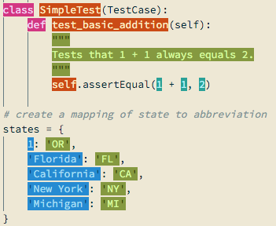
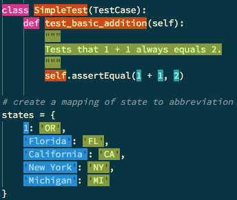

Fork of [flatwhite-syntax](https://github.com/biletskyy/flatwhite-syntax) with
the colours switched to [solarized](http://ethanschoonover.com/solarized).

Also more aggressive python highlighting, as the original was a bit weak.

Light and dark modes, depending on how you feel.
Switching between them is a bit buggy, you may have to make the change and then
restart atom for it to take full effect although this seems to depend on the
ui theme.

#### screenshots:

